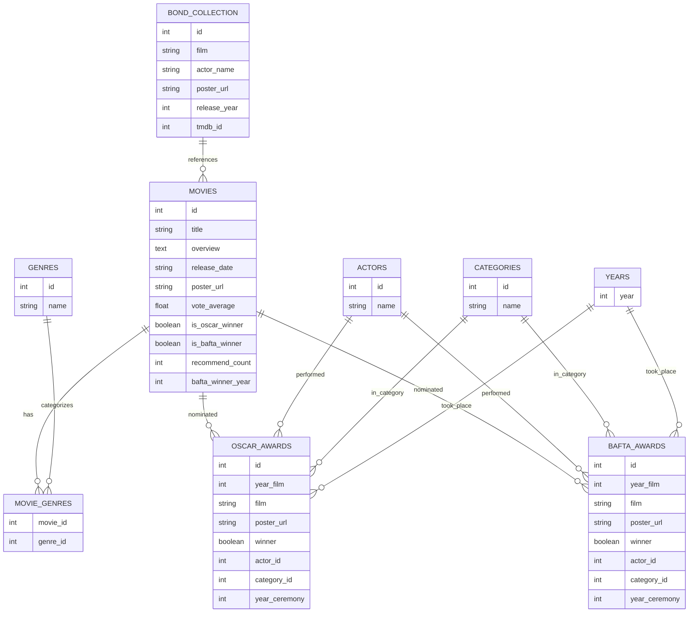

# Movie API Schema

```mermaid
erDiagram
    MOVIES {
        int id
        string title
        text overview
        string release_date
        string poster_url
        float vote_average
        boolean is_oscar_winner
        boolean is_bafta_winner
        int recommend_count
        int bafta_winner_year
    }

    GENRES {
        int id
        string name
    }

    MOVIE_GENRES {
        int movie_id
        int genre_id
    }

    ACTORS {
        int id
        string name
    }

    CATEGORIES {
        int id
        string name
    }

    YEARS {
        int year
    }

    OSCAR_AWARDS {
        int id
        int year_film
        string film
        string poster_url
        boolean winner
        int actor_id
        int category_id
        int year_ceremony
    }

    BAFTA_AWARDS {
        int id
        int year_film
        string film
        string poster_url
        boolean winner
        int actor_id
        int category_id
        int year_ceremony
    }

    BOND_COLLECTION {
        int id
        string film
        string actor_name
        string poster_url
        int release_year
        int tmdb_id
    }

    MOVIES ||--o{ MOVIE_GENRES : has
    GENRES ||--o{ MOVIE_GENRES : categorizes

    MOVIES ||--o{ OSCAR_AWARDS : nominated
    MOVIES ||--o{ BAFTA_AWARDS : nominated
    ACTORS ||--o{ OSCAR_AWARDS : performed
    ACTORS ||--o{ BAFTA_AWARDS : performed
    CATEGORIES ||--o{ OSCAR_AWARDS : in_category
    CATEGORIES ||--o{ BAFTA_AWARDS : in_category
    YEARS ||--o{ OSCAR_AWARDS : took_place
    YEARS ||--o{ BAFTA_AWARDS : took_place

    BOND_COLLECTION ||--o{ MOVIES : references
```